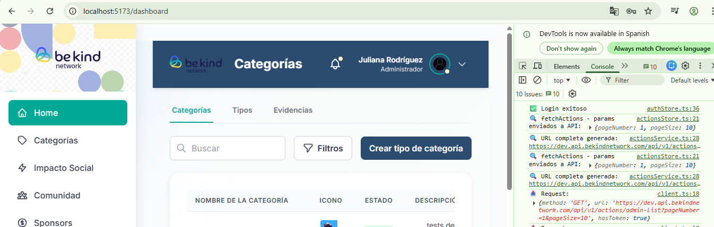
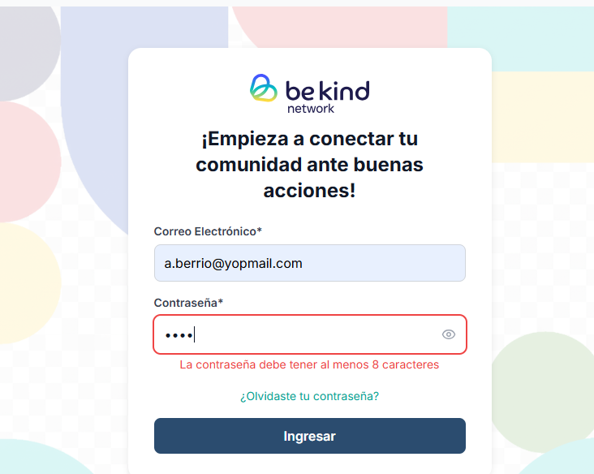
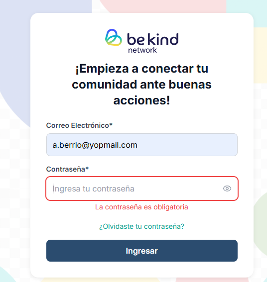
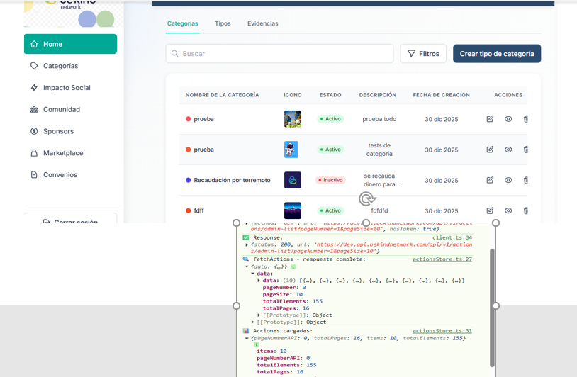
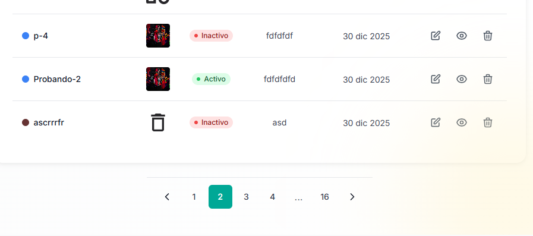
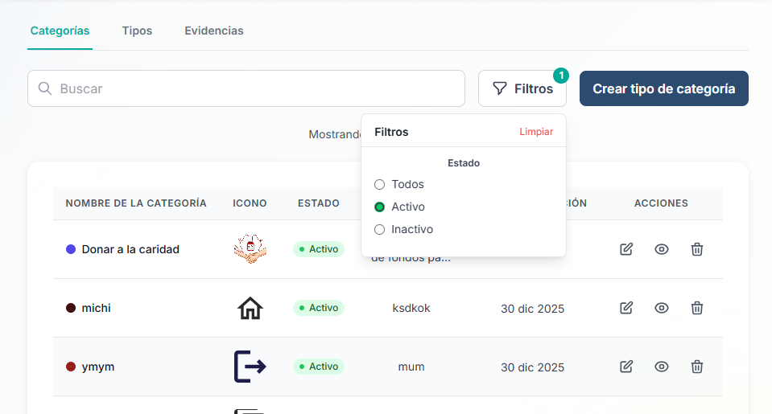
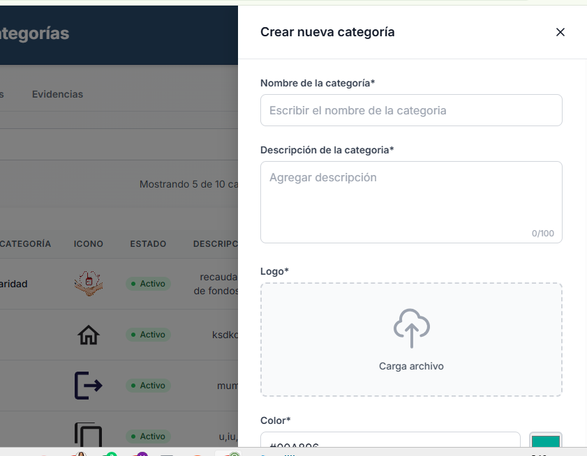
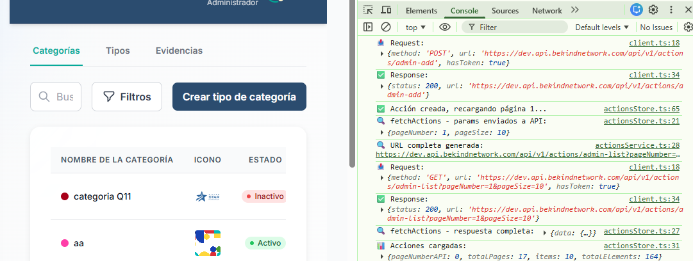
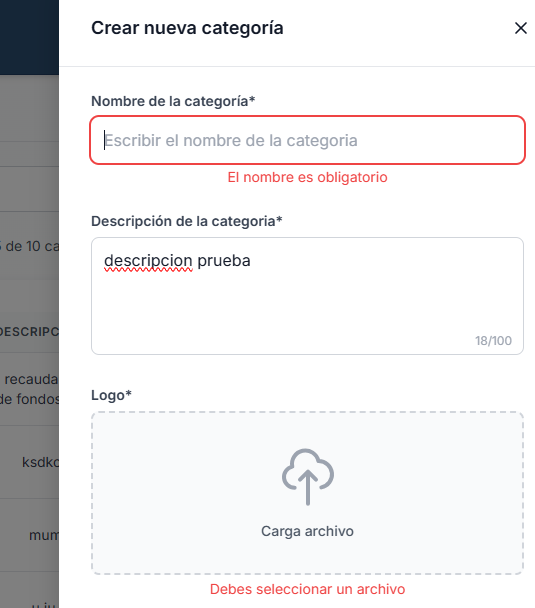
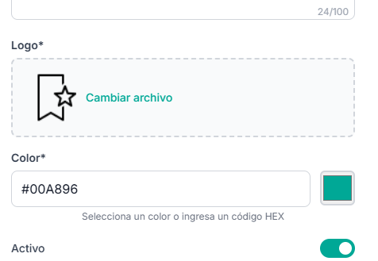

# 🧪 QA Checklist - Be Kind Network Admin

## 📋 Información General

**Proyecto:** Be Kind Network - Panel de Administración  
**Fecha de pruebas:** 30/12/2025  
**Tester:** Maria Elena Arroyo  
**Versión:** 1.0.0  
**Entorno:**
- Navegador: Chrome 131
- Sistema Operativo: Windows 11
- Resolución: 1920x1080
- URL: http://localhost:5173

---

## ✅ Resultados Generales

| Total Casos | Pasados ✅ | Fallidos ❌ |
|-------------|-----------|------------|
| 10          | 10        | 0          |

---

## 🔐 1. Módulo de Autenticación

### TC-001: Login exitoso
**Objetivo:** Verificar que un usuario puede iniciar sesión con credenciales válidas.

**Precondiciones:**
- Usuario: `a.berrio@yopmail.com`
- Password: `AmuFK8G4Bh64Q1uX+IxQhw==`

**Pasos:**
1. Acceder a `http://localhost:5173/login`
2. Ingresar correo y contraseña
3. Hacer clic en "Ingresar"

**Resultado Esperado:**
- ✅ Redirigir a `/dashboard`
- ✅ Token guardado en localStorage

**Evidencia:**

**Estado:** ✅ PASS  
**Fecha:** 30/12/2025

---

### TC-002: Login con credenciales incorrectas
**Objetivo:** Verificar que el sistema rechaza credenciales inválidas.

**Pasos:**
1. Acceder a `/login`
2. Ingresar email: `a.berrio@yopmail.com`
3. Ingresar password incorrecta: `wr123`
4. Hacer clic en "Ingresar"

**Resultado Esperado:**
- ✅ Mostrar mensaje de error claro
- ✅ No redirigir al dashboard
- ✅ Campos permanecen para reintentar

**Evidencia:**

**Estado:** ✅ PASS  
**Fecha:** 30/12/2025

---

### TC-003: Validación de campos vacíos en login
**Objetivo:** Verificar que el formulario valida campos obligatorios.

**Pasos:**
1. Acceder a `/login`
2. Dejar ambos campos vacíos
3. Hacer clic en "Ingresar"

**Resultado Esperado:**
- ✅ Mostrar error: "La contraseña es obligatoria"
- ✅ No enviar petición al servidor

**Evidencia:**

**Estado:** ✅ PASS  
**Fecha:** 30/12/2025

---

## 📊 2. Módulo de Dashboard

### TC-004: Carga del listado de acciones
**Objetivo:** Verificar que el dashboard carga las acciones correctamente tras login.

**Precondiciones:**
- Usuario autenticado

**Pasos:**
1. Login exitoso
2. Observar el dashboard

**Resultado Esperado:**
- ✅ Mostrar tabla con datos de la API
- ✅ Mostrar columnas: Nombre, Descripción, Icono, Color, Estado, Fecha

**Evidencia:**

**Estado:** ✅ PASS  
**Fecha:** 30/12/2025

---

### TC-005: Paginación - Navegación entre páginas
**Objetivo:** Verificar que la paginación funciona correctamente.

**Pasos:**
1. En el dashboard, ubicar el paginador inferior
2. Hacer clic en "Página 2"
3. Observar que se cargan nuevos datos
4. Hacer clic en "Página 3"
5. Usar botones "←" y "→" para navegar

**Resultado Esperado:**
- ✅ Mostrar 10 items por página
- ✅ Al cambiar página, actualizar tabla
- ✅ Página actual resaltada visualmente
- ✅ Indicador de página activa correcto
- ✅ Botones funcionando correctamente

**Evidencia:**

**Estado:** ✅ PASS  
**Fecha:** 30/12/2025

---

### TC-006: Filtros por estado
**Objetivo:** Verificar que los filtros de estado funcionan correctamente.

**Pasos:**
1. En el dashboard, hacer clic en botón "Filtros"
2. Seleccionar filtro "Activo"
3. Observar resultados filtrados
4. Cambiar a filtro "Inactivo"
5. Seleccionar "Todos" para ver todos los registros

**Resultado Esperado:**
- ✅ Abrir menú desplegable de filtros
- ✅ Mostrar opciones: Todos, Activo, Inactivo
- ✅ Al seleccionar "Activo", mostrar solo activos
- ✅ Al seleccionar "Inactivo", mostrar solo inactivos
- ✅ Al seleccionar "Todos", mostrar todos los registros
- ✅ Actualizar tabla según filtro seleccionado

**Evidencia:**

**Estado:** ✅ PASS  
**Fecha:** 30/12/2025

---

## ➕ 3. Módulo de Crear Acción

### TC-007: Abrir formulario de creación
**Objetivo:** Verificar que el botón abre el drawer/modal correctamente.

**Pasos:**
1. En dashboard, hacer clic en "Crear tipo de categoría"
2. Observar que se abre el drawer

**Resultado Esperado:**
- ✅ Abrir drawer/modal desde el lado derecho
- ✅ Mostrar formulario vacío con todos los campos
- ✅ Título visible: "Crear nueva categoría"

**Evidencia:**

**Estado:** ✅ PASS  
**Fecha:** 30/12/2025

---

### TC-008: Crear acción exitosa con todos los campos
**Objetivo:** Verificar que se puede crear una acción completa.

**Pasos:**
1. Abrir formulario de creación
2. Ingresar nombre: "Donación de sangre"
3. Ingresar descripción: "Campaña de donación de sangre a nivel nacional"
4. Seleccionar color: `#4F46E5`
5. Subir archivo SVG/imagen válida
6. Estado: Activo (toggle ON)
7. Hacer clic en "Crear"

**Resultado Esperado:**
- ✅ Mostrar loader: "Creando..."
- ✅ Cerrar drawer al completar
- ✅ Refrescar listado automáticamente
- ✅ Nueva acción visible en la primera página

**Evidencia:**

**Estado:** ✅ PASS  
**Fecha:** 30/12/2025

---

### TC-009: Validación de campos obligatorios en crear acción
**Objetivo:** Verificar que el formulario valida todos los campos requeridos.

**Pasos:**
1. Abrir formulario de creación
2. Dejar todos los campos vacíos
3. Hacer clic en "Crear"

**Resultado Esperado:**
- ✅ Mostrar error: "El nombre es obligatorio"
- ✅ Mostrar error: "La descripción es obligatoria"
- ✅ Mostrar error: "Debes seleccionar un archivo"
- ✅ No enviar petición al servidor
- ✅ Drawer permanece abierto

**Evidencia:**

**Estado:** ✅ PASS  
**Fecha:** 30/12/2025

---

### TC-010: Upload de archivo y preview
**Objetivo:** Verificar que el upload de archivo funciona correctamente.

**Pasos:**
1. Abrir formulario de creación
2. Hacer clic en "Carga archivo"
3. Seleccionar imagen válida (SVG/PNG/JPG)
4. Observar preview

**Resultado Esperado:**
- ✅ Mostrar preview de la imagen seleccionada
- ✅ Mostrar nombre del archivo
- ✅ Permitir cambiar archivo
- ✅ Validar tamaño máximo (5MB)
- ✅ Validar formatos permitidos

**Evidencia:**

**Estado:** ✅ PASS  
**Fecha:** 30/12/2025

---

## 📝 Notas Adicionales

### Bugs Encontrados
- Ninguno

### Observaciones
- Todas las funcionalidades principales operan correctamente
- Validaciones funcionan como se espera con React Hook Form + Zod
- Estados de loading mejoran la experiencia de usuario
- Paginación responde correctamente (base 1)
- Filtros funcionan de manera fluida

## ✅ Conclusión

Todos los flujos críticos funcionan correctamente:
- ✅ Autenticación completa (login, validaciones )
- ✅ Listado paginado con estados de loading
- ✅ Filtros por estado operativos
- ✅ Creación de acciones con validaciones robustas
- ✅ Upload de archivos funcional con preview
- ✅ Manejo de errores apropiado en todos los módulos

**Estado del proyecto:** ✅ READY FOR REVIEW

**Firma:** Maria Elena Arroyo 
**Fecha:** 30/12/2025
